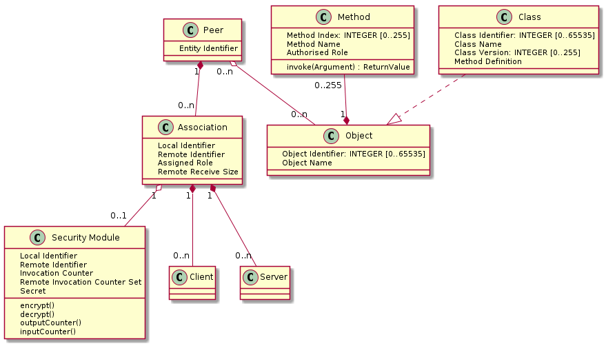

PR6
===

Protocol 6 is a machine-to-machine specification useful for building
connected applications between resource constrained devices.

The main features of PR6 are:

- Stateless
- Peer-To-Peer
- Peers interact by mechanism of Remote Method Invocation
    - Objects represent application layer features
    - Classes define the characteristics of Objects
    - Peers interact with remote Objects by Methods
    - messages transport Method arguments and return values
- Extensible by applications through definition of new Classes and Objects
- Compact canonical message encoding
- Multiple method invocations per message to reduce chatter
- Method arguments and return values are defined by Class
- Per Method role based access control
- End-to-end authenticated encryption with protection against replayed messages
- Confirmed and non-confirmed invocation modes

A PR6 Peer has the following characteristics:

PR6 messages are as follows:

[link](doc/asn1/pr6.asn1 "PR6 ASN.1")

# License

MIT license.

Cameron Harper (C) 2016

